# Creating API Credentials

The following page includes details of how you go about setting up an OAuth client that can access the Workfront APIs

## Step 1: Developer Console Access

API setup is done through [Adobe Developer Console](http://developer.adobe.com). 

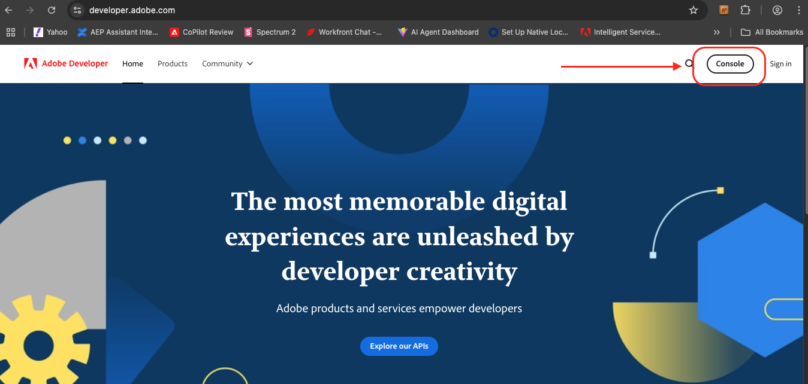

### Gaining Access to Devleloper Console

Workfront today does not support the Admin Console "Developer" role, so the only way to access the developer console is to be a full IMS Org admin. This is NOT the same as a Workfront product admin, but someone who manages the whole org and all products under it. You will need to work with the system admin of the Org to help configure the "Workfront API" credentials or ask to become a full system admin. Making someone an Org system admin can only be done by other IMS Org system admins. 

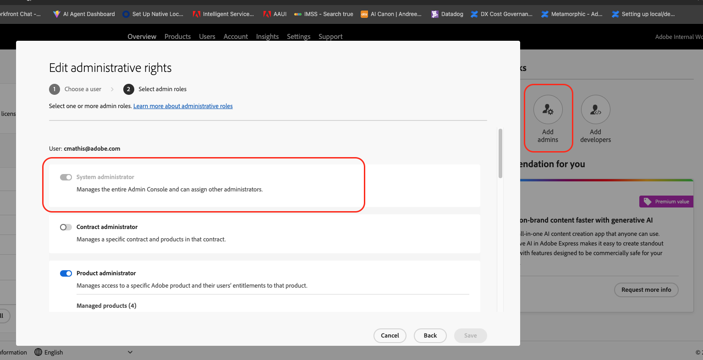

## Step 2: Creating an OAuth Client

After logging into the console you will see an option to create a Project. "Projects" are a way to managed different integrations or client apps. 

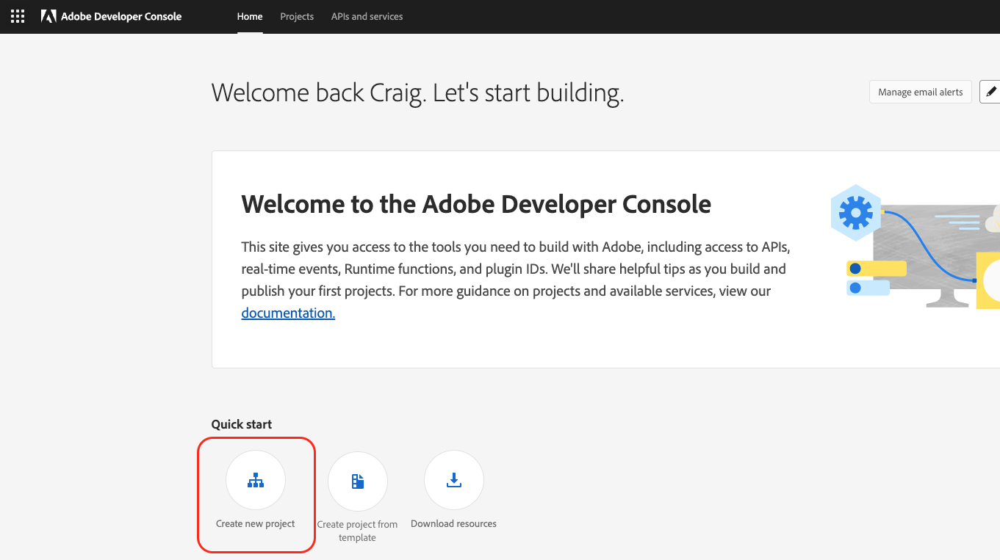

After you create a Project you will see an option to add an API

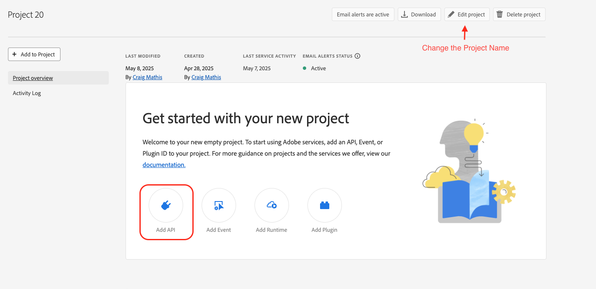

All Workfront API's (Workfront Planning, Workfront Workflow, Review and Approvals, etc.) are associated with a single API named "Adobe Workfront" found under the "Experience Cloud" category. 

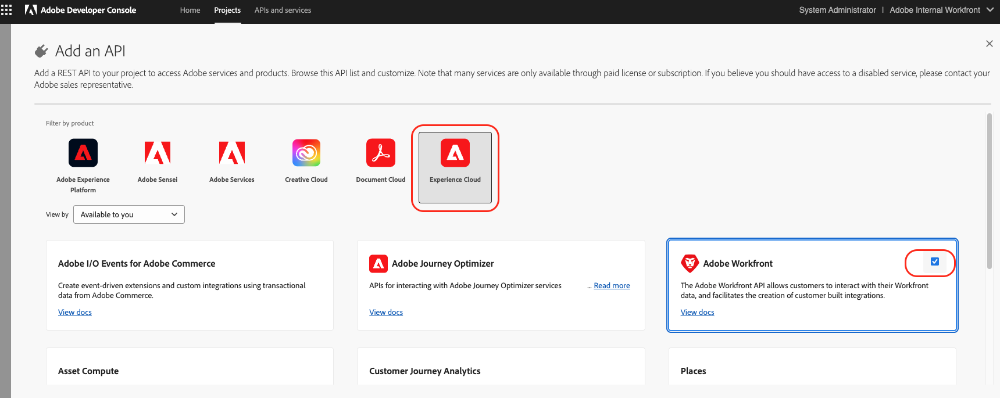

Select the "Server-to-Server" option

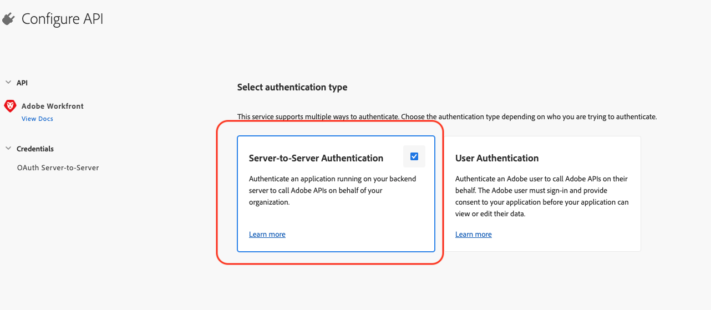

If the IMS Org has multiple instances, then select the instance you want the API client to be associated with

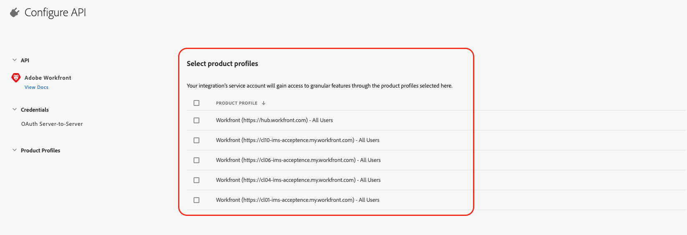

Once selected, you will be sent back to the Project page where your new Oauth Server-to-Server credential is listed.

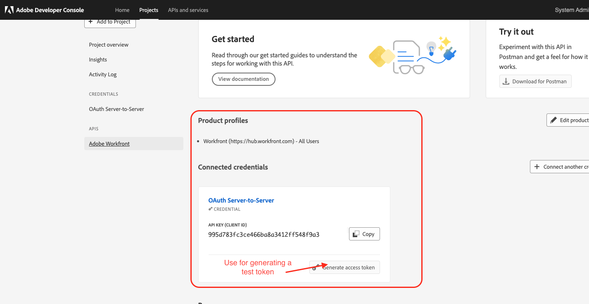

Clicking into the details of that credential you can see important information that includes how you generate the access token.

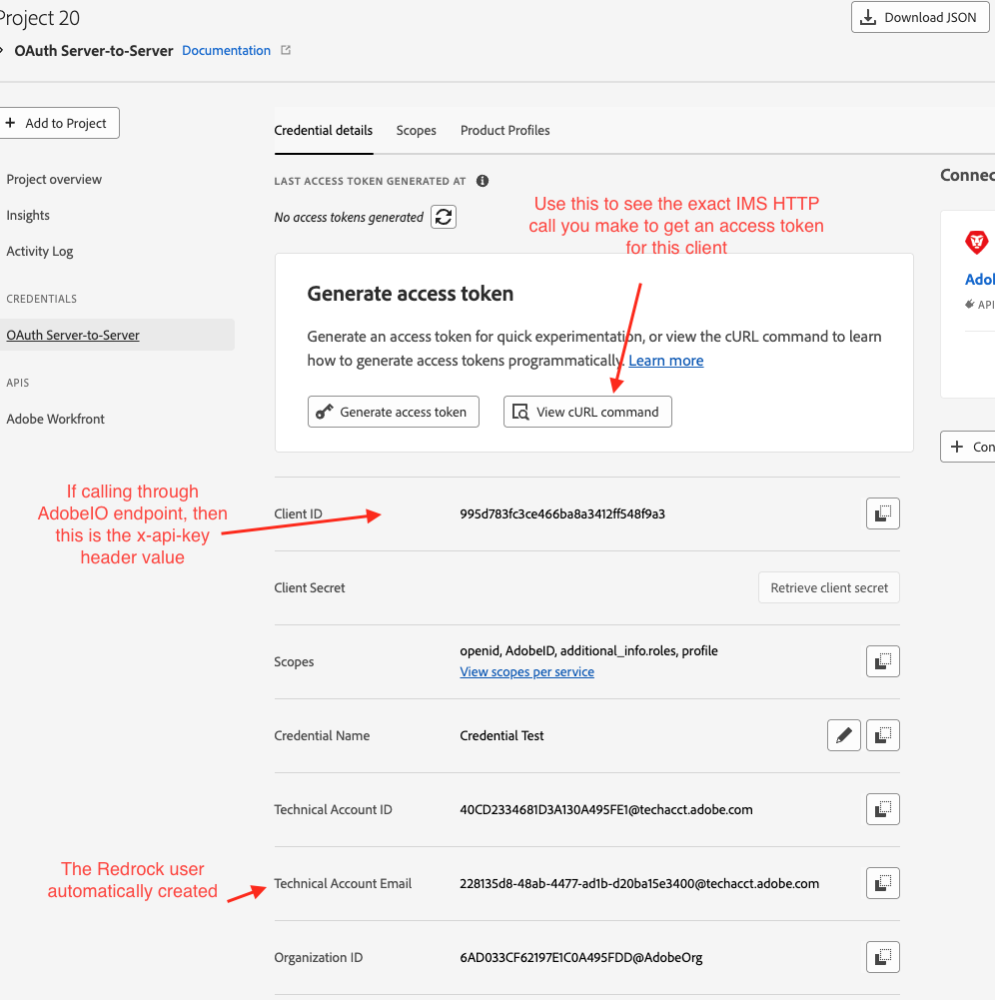

## Step 3: Assign Access to API Client

When you create an API client (aka Technical Account) within the Dev Console, that client is automatically added as a "User" within the Workfront product. 

Within Workfront you can do a search for users with "techacct" and confirm you find the one that matches the "Technical Account Email" you just created. Just like adding a human to Workfront via the Admin Console - this process will automtatically assign the API user as a Contributor with limited access.

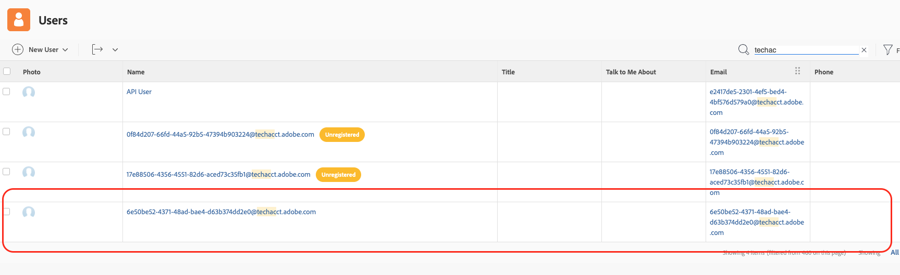

Treat this Technical Account like any other user and adjust their access level or assign them to things.

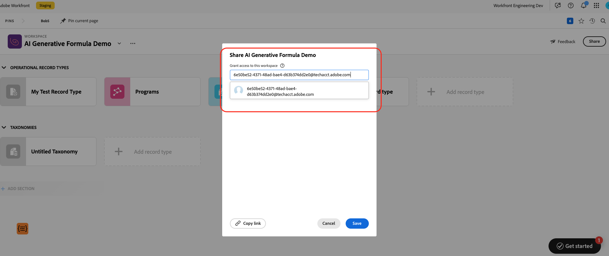

## Optional - Give the API User Admin Access

The way you make users admins in Workfront is to make them an admin of the Product Profile within the Admin Console. 

If you want to give the API credential you created within the developer console admin rights, then add the technical Account Email as an admin of the product profile. Note - the IMS Org may have multiple Workfront instances, so use the product profile under the correct instance.

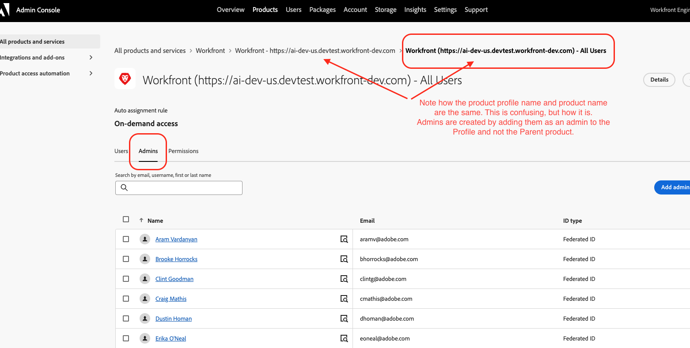

